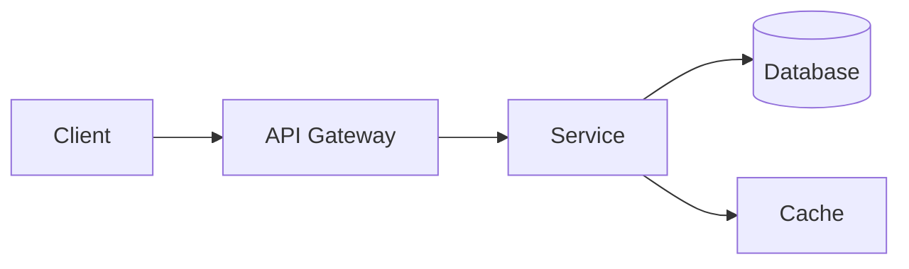

# Documentation Ops

Create and maintain technical documentation following the 5-family documentation model.

## When to Use

- Writing or reviewing technical documentation
- Creating operational runbooks
- Authoring Architecture Decision Records
- Setting up docs-as-code infrastructure (MkDocs, Docusaurus)
- Establishing documentation governance

## The 5-Family Documentation Model

| Family | Purpose | Examples | Audience |
| -------- | --------- | ---------- | ---------- |
| **Tutorials** | Learning-oriented | Getting started guides, walkthroughs | New team members |
| **How-to Guides** | Goal-oriented | Runbooks, procedures, recipes | Operators |
| **Explanation** | Understanding-oriented | ADRs, architecture docs, design rationale | Architects, leads |
| **Reference** | Information-oriented | API docs, config reference, CLI reference | Developers |
| **Operations** | Incident-oriented | Postmortems, SLO dashboards, on-call guides | SRE, on-call |

## Templates

### Service Overview Card

```markdown
# [Service Name]

**Owner:** [Team]
**Repository:** [Link]
**Dashboard:** [Grafana link]
**Runbook:** [Link]

## Purpose
One sentence: what this service does and why it exists.

## Architecture


## Dependencies
| Dependency | Type | Criticality | Fallback |
| ----------- | ------ | ------------- | ---------- |
| PostgreSQL | Database | Critical | Read replica |
| Redis | Cache | Degraded | Direct DB |
| Auth Service | API | Critical | Cached tokens (5min) |

## SLOs
| SLI | Target | Window |
| ----- | -------- | -------- |
| Availability | 99.9% | 30 days |
| Latency (p99) | < 500ms | 30 days |
| Error rate | < 0.1% | 30 days |

## On-Call
- **Escalation:** [PagerDuty service link]
- **Runbook:** [Link to runbook]
- **Known issues:** [Link]
```

### Architecture Decision Record (ADR)

```markdown
# ADR-NNNN: [Title]

**Date:** YYYY-MM-DD
**Status:** Proposed | Accepted | Deprecated | Superseded by ADR-XXXX
**Deciders:** [Names]

## Context
What is the issue or decision that needs to be made?

## Decision Drivers
- [Performance requirement]
- [Team expertise]
- [Cost constraints]
- [Compliance requirement]

## Considered Options
1. **[Option A]** — [Brief description]
2. **[Option B]** — [Brief description]
3. **[Option C]** — [Brief description]

## Decision Outcome
Chosen: **[Option X]** because [justification].

### Pros
- [Advantage 1]
- [Advantage 2]

### Cons
- [Disadvantage 1]
- [Accepted risk]

## Consequences
What changes as a result of this decision. What new constraints does it introduce.
```

### Runbook

See the [incident-management](../incident-management/SKILL.md) skill for the full runbook template.

## Docs-as-Code Tooling

| Tool | Best For | Language | Deployment |
| ------ | --------- | --------- | ---------- |
| MkDocs + Material | Technical docs, API docs | Python/Markdown | GitHub Pages, S3 |
| Docusaurus | Product docs, versioned docs | Node.js/MDX | Vercel, Netlify |
| Sphinx | Python API docs | Python/RST | ReadTheDocs |
| Hugo | Fast static sites | Go/Markdown | Any static host |

### MkDocs Setup

```yaml
# mkdocs.yml
site_name: Project Documentation
theme:
  name: material
  features:
    - navigation.tabs
    - navigation.sections
    - search.suggest
    - content.code.copy

plugins:
  - search
  - mermaid2

nav:
  - Home: index.md
  - Architecture:
    - Overview: architecture/overview.md
    - ADRs: architecture/adrs/
  - Operations:
    - Runbooks: operations/runbooks/
    - Postmortems: operations/postmortems/
  - Reference:
    - API: reference/api.md
    - Configuration: reference/config.md

markdown_extensions:
  - admonition
  - pymdownx.details
  - pymdownx.superfences:
      custom_fences:
        - name: mermaid
          class: mermaid
          format: !!python/name:pymdownx.superfences.fence_code_format
  - pymdownx.tabbed:
      alternate_style: true
```

## Documentation Review Governance

| Document Type | Review Cadence | Reviewers | Staleness Threshold |
| -------------- | --------------- | ----------- | ------------------- |
| Service Overview | Quarterly | Service owner + SRE | 6 months |
| Runbooks | Monthly (on-call) | On-call team | 3 months |
| ADRs | On creation | Architecture board | Never stale (historical) |
| Postmortems | 48h after incident | Incident participants | Never stale |
| API Reference | Each release | Dev team | 1 release behind |
| Tutorials | Semi-annually | DevRel / onboarding | 6 months |

## Diagram Types

| Diagram | Tool | Use Case |
| --------- | ------ | ---------- |
| Architecture | Mermaid `graph` | System components and flows |
| Sequence | Mermaid `sequenceDiagram` | Request/response flows |
| State | Mermaid `stateDiagram-v2` | Lifecycle transitions |
| ER | Mermaid `erDiagram` | Database schemas |
| C4 | Structurizr / PlantUML | Multi-level architecture (Context→Container→Component) |

## Agent Integration

- **`executant-docs-ops`** agent: Documentation quality review and governance
- **`executant-infra-architect`**: ADR review and architecture diagram validation
- **`executant-sre-ops`**: Runbook accuracy and incident response docs
- **`executant-ci-cd-ops`**: docs-as-code CI pipeline (build + deploy MkDocs)
